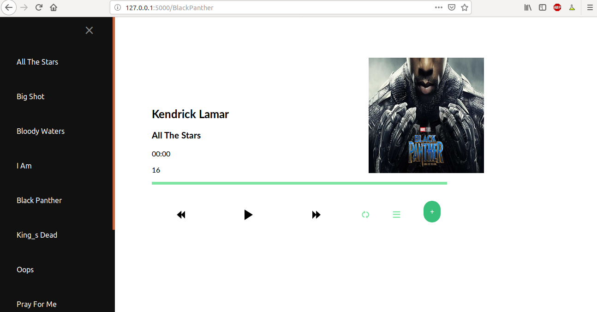

# Flask-Music-app
    A Simple MUsic web app with flask as framework in python, sql as database that can play music,manage playlists,Download songs,etc.
### Prerequisites
    Python 3.0
    mysql
  
### Packages required:
    flask
    passlib
    flask_mail
    flask_mysqldb
    wtforms
    bs4
    youtube-dl(Install using 'sudo pip3 install --upgrade youtube-dl'  )
    
### Installing Packages
    * Do pip3 install -r requirements.txt

### Import sql table
    * Create Database named as my_music in my_music.
    * mysql -u root -p my_music < table.sql

### How to Run app:
    * Clone the repo to your local machine.
    * Install the above given packages.
    * Replace the app.config['MYSQL_PASSWORD']='Enter your sqlpassword'( line 21 in app.py) with you sql password.
    * Replace the Email and password in config.cfg with Email and password of mail from which you want to send the confirmation. mail.
    *Import the table.sql using above steps.
    * Then do python3 app.py.
    * open http://127.0.0.1:5000/ in Your local browser.
    
### Features
     * Login
     * Register and verify using Confirmation mail.
     * Play albums using music player.
     * Download any song of your choice from Search bar.
     * Create Private and public playlists.
     * See the other users Public playlists.
   
 ### How to Contribute:
      * Fork the project using the fork option.
      * Clone this repository to your local machine.
      * Now add upstream by using command - **git remote add upstream "name of my repo"**
      * Create a new branch on your local machine.
      * Start contributing and make a pull request to apply these changes.
 ### Future improvements
      * Improve UI
      * Add downloaded songs in Playlists also.
      * Add Seek in Music palyer.
      * Improvement in Music Albums.
### Current Look
  

###### You can report any other issues also.
   
   
  
 
 
   
